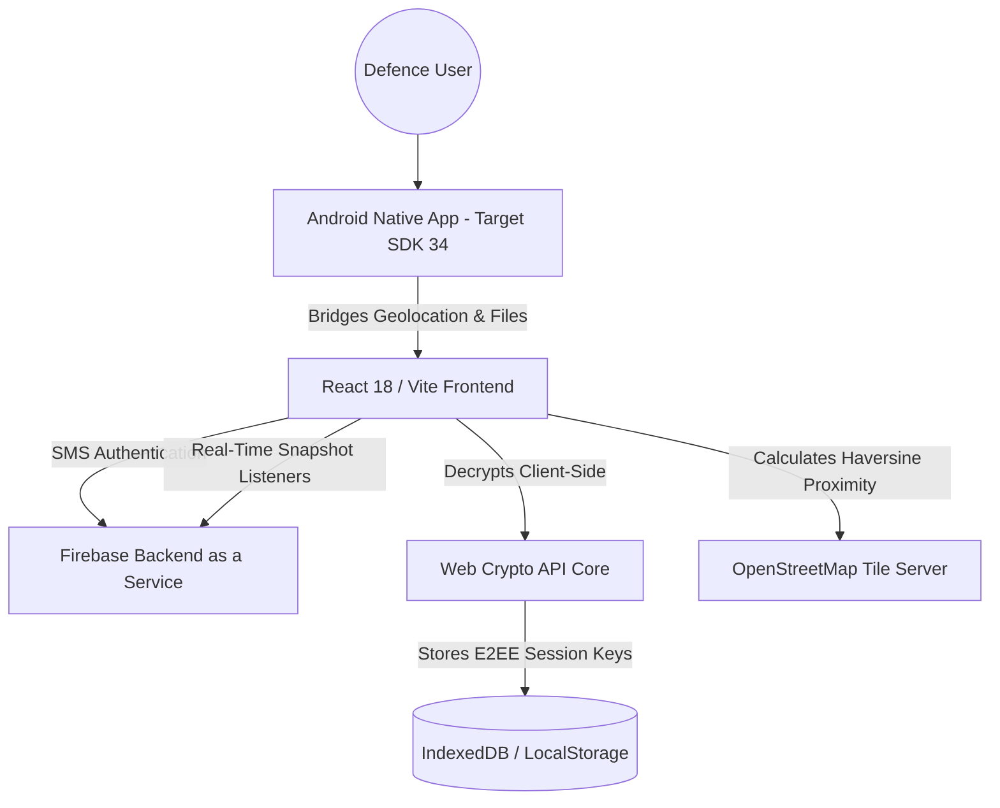
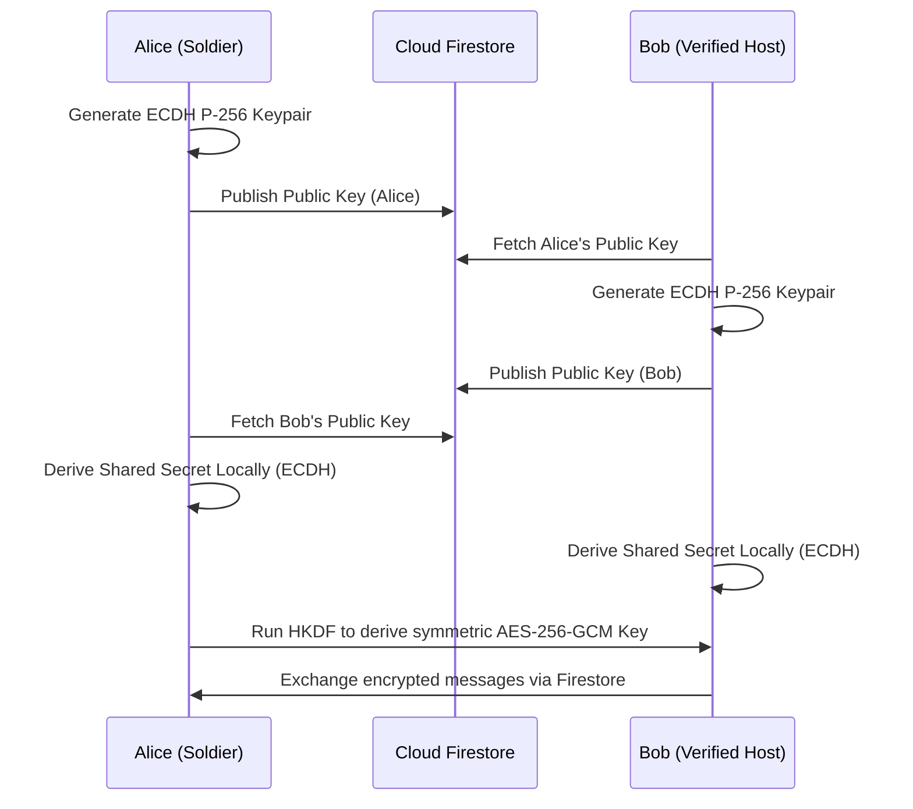

# 🪖 Fauji Niwas — Product Roadmap, Security, and Architecture
> **Incubator-Grade Technical Blueprint, Security Controls, and Strategic Roadmap for India's Privacy-First Military Relocation Platform.**
> Live Web Platform: [faujiniwas.web.app](https://faujiniwas.web.app)
> Document Version: v5.1.0 (Production Hardened & Native Enabled)
> Last Updated: 2026-07-11T21:40:00+05:30

---

## 📋 Detailed Table of Contents

1. [Core Identity & Strategic Positioning](#1-core-identity--strategic-positioning)
   - 1.1 Project Objective & Problem Statement
   - 1.2 Strategic Cantonment Advantage
   - 1.3 Target Demographics & Indian Defence Ecosystem
   - 1.4 HRA / Rank-Based Housing Budget Guidance Heuristics
   - 1.5 Military Security & Data-Isolation Protocols
   - 1.6 Strategic Positioning vs. Commercial Aggregators
   - 1.7 Cantonment Mapping Coverage Matrices
2. [Technology Stack Deep Dive](#2-technology-stack-deep-dive)
   - 2.1 React Core & Vite Bundling Orchestration
   - 2.2 Global State Architecture (Zustand Slices)
   - 2.3 Map Engine (Leaflet.js, OpenStreetMap, & Marker Clustering)
   - 2.4 Progressive Web App (PWA) Offline Strategy
   - 2.5 Native Android Flutter Shell Integration
   - 2.6 Asset Optimization & Image Delivery Strategy
3. [System Architecture & Precise Data Flows](#3-system-architecture--precise-data-flows)
   - 3.1 High-Level Hybrid Cloud Architecture
   - 3.2 Live Database Synchronisation Data Flow
   - 3.3 Dynamic Peer-to-Peer Cryptographic Session Flow
   - 3.4 Web App Manifest & Service Worker Lifecycle
4. [Firestore Database Schemas (Exhaustive Specification)](#4-firestore-database-schemas-exhaustive-specification)
   - 4.1 `/users` Collection Schema
   - 4.2 `/verifications` Collection Schema
   - 4.3 `/listings` Collection Schema
   - 4.4 `/chats` Collection Schema
   - 4.5 `/chats/{chatId}/messages` Sub-Collection Schema
   - 4.6 `/csd_pulse` Collection Schema
   - 4.7 `/audit_logs` Collection Schema
   - 4.8 `/reports` Collection Schema
   - 4.9 Firestore Indexes Configuration
5. [Feature Architecture & Core Algorithms](#5-feature-architecture--core-algorithms)
   - 5.1 Station-Adjacent Commute Proximity Calculation (Haversine Formula)
   - 5.2 Dynamic Trust-Graph & Peer Reputation Scoring (Trust Graph 2.0)
   - 5.3 CSD Home Tiffin Matching & Diet Algorithms
   - 5.4 Rank-Based HRA Allowance & Out-of-Pocket Expense Heuristic
   - 5.5 Client-Side Canvas Document Masking Engine
6. [Native Android Shell & Bridge Configuration](#6-native-android-shell--bridge-configuration)
   - 6.1 `InAppWebView` JavaScript Bridge Overrides
   - 6.2 Native Geolocation & File Selection Handling
   - 6.3 Gradle Build Target Specifications
   - 6.4 `AndroidManifest.xml` Security Permissions Configuration
   - 6.5 Web-to-Native Message Exchange Protocol
7. [Comprehensive Privacy Policy & DPDP Act Principles](#7-comprehensive-privacy-policy--dpdp-act-principles)
   - 7.1 Data Protection Principles & Indian Context
   - 7.2 Strict Personal Identifiable Information (PII) Isolation
   - 7.3 Data Audits & Automatic Deletion Protocols
   - 7.4 DPDP Act 2023 Compliance & Rights Manifest
   - 7.5 Consent Management Framework
8. [Security Governance & Cryptographic Architecture](#8-security-governance--cryptographic-architecture)
   - 8.1 Client-Side AES-256-GCM Document Encryption Vault
   - 8.2 End-to-End Encrypted (E2EE) ECDH P-256 Session Key Rotation
   - 8.3 In-App Vulnerability & CSP Audit Specifications
   - 8.4 Web Crypto API Implementation Reference
   - 8.5 Key Rotation & Revocation Orchestration
9. [Threat Modeling (STRIDE) & Security Controls](#9-threat-modeling-stride--security-controls)
   - 9.1 Assets & Security Objectives
   - 9.2 Trust Boundaries & Entry Points
   - 9.3 STRIDE Threats by Subsystem
   - 9.4 Mitigation Matrix (Controls → Attacks)
   - 9.5 Security Test Plan (What to Validate)
10. [RBAC Documentation (Roles, Permissions, Enforcement)](#10-rbac-documentation-roles-permissions-enforcement)
    - 10.1 Roles Overview
    - 10.2 Permission Model (What each role can do)
    - 10.3 Enforcement Points (Client vs Rules vs Server)
    - 10.4 Admin Workflows & Approval Queues
    - 10.5 RBAC Change Management
11. [Audit Logs (Security & Compliance)](#11-audit-logs-security--compliance)
    - 11.1 What to Log (Event Taxonomy)
    - 11.2 Suggested Firestore Data Model
    - 11.3 Retention, Integrity, and Access Control
    - 11.4 Audit Review Cadence
12. [Firebase App Check (Abuse Prevention & Integrity)](#12-firebase-app-check-abuse-prevention--integrity)
    - 12.1 Threats this mitigates
    - 12.2 Deployment Strategy (Web + Android)
    - 12.3 Enforcement Rollout Plan
    - 12.4 Failure Handling & Observability
13. [Incident Response (IR) & Postmortems](#13-incident-response-ir--postmortems)
    - 13.1 Incident Severity Levels
    - 13.2 Detection & Triage Signals
    - 13.3 Containment, Eradication, Recovery
    - 13.4 Evidence Preservation & Legal Readiness
    - 13.5 Post-incident Review Checklist
14. [Detailed Historical Milestones (Phases 1–8)](#14-detailed-historical-milestones-phases-1-8)
    - 14.1 Phase 1: Foundational Framework
    - 14.2 Phase 2: Trust & Quality
    - 14.3 Phase 3: Communication Layer
    - 14.4 Phase 4: Expansion & Data Pulse
    - 14.5 Phase 5: Design Systems 2.0
    - 14.6 Phase 6: Intelligence & HUD
    - 14.7 Phase 7: Native Stability
    - 14.8 Phase 8: Hardened Security
15. [Advanced Relocation Infrastructure (Phases 9–20)](#15-advanced-relocation-infrastructure-phases-9-20)
    - 15.1 Phase 9: All-India Data Foundation
    - 15.2 Phase 10: Relocation Operating System
    - 15.3 Phase 11: Defence Ecosystem Expansion
    - 15.4 Phase 12: Analytics & Heuristics Layer
    - 15.5 Phases 13–15: Scale & Market Maturity
    - 15.6 Phases 16–20: Platform Expansion Foundation
16. [Privacy-First Community Protection Suite (Phases 21–30)](#16-privacy-first-community-protection-suite-phases-21-30)
    - 16.1 Phase 21: Connection Security Gatekeeper & SIEM Console
    - 16.2 Phase 22: Offline Compass & Commute Navigation
    - 16.3 Phase 23: Veteran ECHS Health & Pension Vault
    - 16.4 Phase 24: Checked Title Proofs & Rental Agreement Badges
    - 16.5 Phase 25: Offline Mesh SOS Distress Broadcaster
    - 16.6 Phase 26: SEO Fix & 3D Dark Glassmorphic Landing Page
    - 16.7 Phase 27: Indian Spacing Overhaul, Mobile Drawer Fixes & Live CSD Pulse Backend
    - 16.8 Phase 28: Interactive Gateway Steppers, Accessibility Contrast Upgrades & Simplified Dashboard Footer
    - 16.9 Phase 29: AI Matcher & Smart Rent Estimator Suite
    - 16.10 Phase 30: Hardened Security, Real Decryption & Native APK Compilation
17. [Next-Generation Strategic Expansion (Phases 31–40)](#17-next-generation-strategic-expansion-phases-31-40)
    - 17.1 Phase 31: Advanced ECHS Medical Appointments & OPD Queue Estimations
    - 17.2 Phase 32: Inter-Cantonment Peer-to-Peer Logistics Routing Protocols
    - 17.3 Phase 33: Multi-Tenant Administrative RBAC with Localized Station Moderator Boards
    - 17.4 Phase 34: Machine Learning-Driven Fraud Listing Models (Client-Side ONNX)
    - 17.5 Phase 35: Offline Radio Mesh Emergency Network Protocols
    - 17.6 Phase 36: Decentralized Web3 Landlord Trust Scores & Smart Contracts
    - 17.7 Phase 37: WebAssembly-Powered client-side OCR and document parsing
    - 17.8 Phase 38: Real-time collaborative inventory moving dashboard
    - 17.9 Phase 39: Automated KV and APS school admission seat locator trackers
    - 17.10 Phase 40: Veteran employment classified listings and matching portal
18. [Security Execution Roadmap Addendum](#18-security-execution-roadmap-addendum)
19. [Firestore Security Rules (Implemented)](#19-firestore-security-rules-implemented)
20. [Backup, Recovery & Dependency Security](#20-backup-recovery--dependency-security)
21. [Platform Completion Assessment](#21-platform-completion-assessment)
22. [Sustainability & Revenue Model](#22-sustainability--revenue-model)
23. [Changelog](#23-changelog)
24. [Appendix A: Complete Document Encryption Module (`documentEncrypt.js`)](#appendix-a-complete-document-encryption-module-documentencryptjs)
25. [Appendix B: Automated SEO Static Page Compilation Script (`generate_seo_pages.cjs`)](#appendix-b-automated-seo-static-page-compilation-script-generate_seo_pagescjs)
26. [Appendix C: Firebase Deployment Configuration (`firebase.json`)](#appendix-c-firebase-deployment-configuration-firebasejson)
27. [Appendix D: UI Modals Component Mapping and Architecture](#appendix-d-ui-modals-component-mapping-and-architecture)
28. [Appendix E: Cantonment Proximity Index Map Coordinates Database Reference](#appendix-e-cantonment-proximity-index-map-coordinates-database-reference)
29. [Appendix F: Complete Security Testing Script Boilerplate](#appendix-f-complete-security-testing-script-boilerplate)
30. [Appendix G: Android Release Build and Signature Key Management Protocol](#appendix-g-android-release-build-and-signature-key-management-protocol)
31. [Appendix H: ECHS Medical Polyclinics Matrix](#appendix-h-echs-medical-polyclinics-matrix)
32. [Appendix I: Progressive Web App Service Worker Implementation Blueprint (`sw.js`)](#appendix-i-progressive-web-app-service-worker-implementation-blueprint-swjs)
33. [Appendix J: CI/CD Pipeline Automation Architecture (`deploy.yml`)](#appendix-j-cicd-pipeline-automation-architecture-deployyml)

---

## 1. CORE IDENTITY & STRATEGIC POSITIONING

### 1.1 Project Objective & Problem Statement
Every year, thousands of military, paramilitary, and defence civilian families in India face sudden, mandatory relocation orders. The transfer process is logistically complex, physically demanding, and highly vulnerable to predatory housing brokers who charge exorbitant, illegal fees (often demanding 1–2 months' rent as brokerage fee) near Cantonment limits. 

**Fauji Niwas** provides a privacy-first, zero-brokerage digital housing finder designed specifically to help active-duty soldiers, veterans, and military families find safe, Cantonment-adjacent rentals, shared roommates, home-cooked food, and packers & movers options without losing data privacy. The platform addresses:
* **The Brokerage Trap**: Completely eliminating civilian brokers targeting defense personnel near base entrances.
* **Locational Friction**: Standard mapping apps fail to plot locations in relation to military infrastructure gates, checkposts, and school bus routes.
* **Information Asymmetry**: Relocating soldiers do not know if a listing meets their House Rent Allowance (HRA) pay ceiling or if a landlord has a history of harassment against temporary occupants.

### 1.2 Strategic Cantonment Advantage
Unlike commercial real estate platforms that focus heavily on commercial hotspots and high-margin high-rises, Fauji Niwas is specifically built around **Cantonment Areas (Military Stations)**. We offer:
* **Station-Adjacent Locality Mapping**: Centering listings and amenities close to station boundaries, Cantonment Gates, and checkposts.
* **ID-Based Credentialing**: Vetting user accounts through voluntary, community-led verification using masked credentials.
* **Institutional Landmark Proximity**: Showing immediate walking or driving travel times to crucial locations like Unit Run Canteens (URCs), Military Hospitals (MH), Army Public Schools (APS), and Kendriya Vidyalayas (KV).

### 1.3 Target Demographics & Indian Defence Ecosystem
The platform actively serves four critical segments of the Indian Defence forces:
1. **Relocating Families**: Personnel seeking secure, family-friendly rental units close to Cantonment gates, school bus routes, and URC depots.
2. **Duty Bachelors & Officers**: Young officers seeking single rooms, tiffin services, and military roommates to share costs.
3. **SSB Candidates**: Aspirants attending selection boards near Bhopal, Kapurthala, Prayagraj, Coimbatore, and Bangalore, requiring walking-distance dormitories and budget auto guides.
4. **Retired Veterans**: Senior veterans seeking retirement properties adjacent to major Station Hospitals and ECHS polyclinics.

### 1.4 HRA / Rank-Based Housing Budget Guidance Heuristics
Because actual House Rent Allowance (HRA) depends dynamically on pay matrix levels, city classifications (Class X, Y, and Z), postings, and official quarters availability, the platform uses pay matrix rent guidance benchmarks:
* **OR (Other Ranks / Sepoy to Havildar)**: Budget limits targeting ₹5,000 – ₹15,000/month.
* **JCO (Junior Commissioned Officers / Naib Subedar to Subedar Major)**: Budget limits targeting ₹15,000 – ₹30,000/month.
* **Officer (Lieutenant to General)**: Budget limits targeting ₹30,000 – ₹60,000+/month.

The HRA allowance follows the Seventh Central Pay Commission (7th CPC) allocations:
* **Level 3 to Level 5 (Sepoy to Havildar)**: Basic Pay ₹21,700 – ₹29,200. Max HRA: Class X: ₹8,000; Class Y: ₹5,400; Class Z: ₹3,600.
* **Level 6 to Level 9 (Naib Subedar to Subedar Major)**: Basic Pay ₹35,400 – ₹53,100. Max HRA: Class X: ₹14,400; Class Y: ₹9,600; Class Z: ₹6,400.
* **Level 10 to Level 14 (Lieutenant to Brigadier)**: Basic Pay ₹56,100 – ₹1,44,200. Max HRA: Class X: ₹38,000; Class Y: ₹26,000; Class Z: ₹17,000.

### 1.5 Military Security & Data-Isolation Protocols
To preserve operational security and adhere to civil-military boundary limits, Fauji Niwas implements strict structural data isolation:
* **No Unit-Level Data Collection**: The database does not record the user's unit name, division, regiment, or current military operation code.
* **Obfuscated Coordinates**: Exact latitude and longitude parameters for listings inside military stations are disallowed.
* **Independent Hosting**: The database is hosted on public commercial servers completely decoupled from internal military intranet systems.

### 1.6 Strategic Positioning vs. Commercial Aggregators
Commercial platforms (e.g. MagicBricks, 99acres, Housing.com, NoBroker) evaluate rentals purely through pricing indices and commercial viability metrics. They depend heavily on broker listings to inflate catalog sizes, resulting in high fees. 
Fauji Niwas rejects these approaches. Our model focuses exclusively on:
1. **Zero Brokerage Policies**: Enforcing a strict ban on brokers. Any user acting as a commercial broker is reported, flagged, and permanently removed from the database.
2. **Proximity to Cantonment Infrastructures**: Rerouting maps to filter on distances from base gates, Kendriya Vidyalayas, and canteens rather than downtown areas.
3. **Security Standards**: Integrating end-to-end encrypted chats and client-side credential scans, which commercial apps skip to lower registration thresholds.

### 1.7 Cantonment Mapping Coverage Matrices
The system operates across 9 initial strategic Cantonments, each parsed according to localized housing constraints:
* **Pune Cantonment**: High density of military hospitals (MH Pune, Command Hospital). Relocation targets center around Wanowrie, Ghorpadi, and Camp.
* **Delhi Cantonment**: Highest officer density. Relocation targets focus on Sadar Bazar, Mehram Nagar, and adjacent Dhaula Kuan corridors.
* **Ambala Cantonment**: Key transit hub. Relocation targets map properties near Ambala Air Force Station and Ambala Cantt Junction.
* **Secunderabad Cantonment**: Large JCO/OR community. Housing focus centers on Trimulgherry, Bowenpally, and Karkhana.
* **Bhopal Cantonment**: Focuses on accommodation for personnel attending Selection Centre Central.
* **Kapurthala Cantonment**: High density of SSB candidates. Focuses on temporary boarding dormitories near the SSB center.
* **Prayagraj Cantonment**: Serves Selection Centre East. Relocation targets are mapped near the Old Cantt and New Cantt boundaries.
* **Coimbatore Cantonment**: Focuses on personnel attending Selection Centre South.
* **Bangalore Cantonment**: High veteran concentration. Mapped near ECHS Polyclinic and Command Hospital Air Force.

---

## 2. TECHNOLOGY STACK DEEP DIVE

### 2.1 React Core & Vite Bundling Orchestration
The web interface is engineered as an ultra-fast Single Page Application (SPA) using **React 18** and **Vite**.
* **Chunk Splitting Strategy**: Vite is configured with manual chunking inside `vite.config.js` to separate React core modules from Leaflet maps, Firebase services, and Zustand stores. This produces optimized split bundles to ensure fast loading times on field networks.
* **Zero-Bleed CSS**: Vanishing vanilla CSS Modules maintain structural class scoping, ensuring that styling remains isolated.

### 2.2 Global State Architecture (Zustand Slices)
Global state is managed via **Zustand**, with persistent state written directly to IndexedDB or LocalStorage.
```javascript
import { create } from 'zustand';
import { persist, createJSONStorage } from 'zustand/middleware';

export const useFilterStore = create(
  persist(
    (set) => ({
      listings: [],
      activeView: 'rentals',
      searchQuery: '',
      showCommuteZones: false,
      showSchools: false,
      showHospitals: false,
      showCanteens: false,
      savedSearches: [],
      setActiveView: (view) => set({ activeView: view }),
      setListings: (list) => set({ listings: list }),
      setSearchQuery: (query) => set({ searchQuery: query }),
      saveSearch: (searchObj) => set((state) => ({ savedSearches: [...state.savedSearches, searchObj] })),
      clearSavedSearches: () => set({ savedSearches: [] }),
    }),
    {
      name: 'fauji-niwas-filters',
      storage: createJSONStorage(() => localStorage),
    }
  )
);
```

### 2.3 Map Engine (Leaflet.js, OpenStreetMap, & Marker Clustering)
* **Leaflet OSM Tiles**: OpenStreetMap tiles are dynamically rendered with custom canvas overlays for high-performance navigation.
* **Marker Clustering**: Utilises `leaflet.markercluster` to dynamically group high-density properties, maintaining smooth rendering layouts optimized for low-end devices.

### 2.4 Progressive Web App (PWA) Offline Strategy
* **Service Workers**: Aggressive caching assets store map scripts, application shells, and previous housing queries.
* **Offline Fallbacks**: When internet connection drops, the PWA displays cached properties and switches the mapping screen to the offline vector navigation compass.

### 2.5 Native Android Flutter Shell Integration
* **Flutter InAppWebView**: Leverages an optimized native Flutter WebView shell that injects custom headers, bypasses web engine rendering latency, and bridges the device camera and file system securely.

### 2.6 Asset Optimization & Image Delivery Strategy
To maximize performance on poor mobile networks, all listings images undergo aggressive optimization:
* **WebP Conversion**: All uploaded files are compressed client-side to lightweight WebP files before database ingestion.
* **Max Dimension Restrictions**: Client scripts resize uploaded media to a maximum width of 800px.
* **Responsive Image Layouts**: HTML code leverages `srcset` configurations, ensuring devices request only the image size matching their pixel ratios.

---

## 3. SYSTEM ARCHITECTURE & PRECISE DATA FLOWS

### 3.1 High-Level Hybrid Cloud Architecture


### 3.2 Live Database Synchronisation Data Flow
1. **Real-time Synchronization**: Client-initiated Firestore realtime subscription queries targeting the `/listings` collection.
2. **Client-Side Geo-Filtering**: Properties are filtered in-memory based on proximity to selected Cantonment coordinates.
3. **Outlier Flags**: The client performs local mathematical rent evaluations against city average prices, instantly raising warning flags on listing cards if price anomalies are detected.

### 3.3 Dynamic Peer-to-Peer Cryptographic Session Flow


### 3.4 Web App Manifest & Service Worker Lifecycle
The PWA manifest drives installation and standalone orientation across target devices:
```json
{
  "name": "Fauji Niwas — Defence Housing Live Map",
  "short_name": "Fauji Niwas",
  "description": "Find verified defence housing, SSB dorms & food near cantonment stations across India.",
  "start_url": "/",
  "display": "standalone",
  "background_color": "#0b1325",
  "theme_color": "#FF9933",
  "orientation": "portrait",
  "icons": [
    {
      "src": "favicon.svg",
      "sizes": "any",
      "type": "image/svg+xml",
      "purpose": "any maskable"
    }
  ],
  "categories": ["utilities", "real estate", "navigation"]
}
```
The Service Worker intercepts network requests:
1. **Install Stage**: Precaches core CSS, JS bundles, icons, and layout skeletons.
2. **Activate Stage**: Removes deprecated caching structures.
3. **Fetch Stage**: Implements a "Stale-While-Revalidate" strategy for assets, but switches to a "Network-First" logic for dynamic database queries.

---

## 4. FIRESTORE DATABASE SCHEMAS (EXHAUSTIVE SPECIFICATION)

### 4.1 `/users` Collection Schema
* **Path**: `/users/{userId}`
* **Description**: Houses primary user profile information, verification badges, and gamification points.
* **Constraints**: Role attributes can only be updated by admins. Users can update their display names and ranks, but not verification markers.
```typescript
interface UserDocument {
  uid: string; // Firebase Auth UID
  phoneNumber: string; // E.164 format (+91...)
  displayName: string; // Chosen name / initials
  rank: 'OR' | 'JCO' | 'Officer'; // Pay Matrix Band Category
  role: 'user' | 'verified_host' | 'moderator' | 'admin'; // Authorization Level
  verified: boolean | 'pending'; // Approval State
  points: number; // Gamified Contribution Score
  createdAt: number; // Epoch Milliseconds
}
```

### 4.2 `/verifications` Collection Schema
* **Path**: `/verifications/{userId}`
* **Description**: Holds sensitive verification metadata and encryption keys.
* **Constraints**: Document read and update operations restricted exclusively to moderators and admins. Users can only write their own verification documents.
```typescript
interface VerificationDocument {
  uid: string; // Target user's UID
  fileUrl: string; // Secure Cloud Storage path to encrypted ID image
  iv: string; // Hex representation of the 12-byte initialization vector
  hexKey: string; // Hex representation of the AES-256 decryption key (Admin restricted)
  status: 'pending' | 'approved' | 'rejected';
  uploadedAt: number; // Epoch Milliseconds
  processedAt?: number; // Epoch Milliseconds
}
```

### 4.3 `/listings` Collection Schema
* **Path**: `/listings/{listingId}`
* **Description**: Stores Cantonment accommodations posted by hosts.
* **Constraints**: Write operations validate that price is positive and title checked indicators default to false.
```typescript
interface ListingDocument {
  id: string; // Document Auto ID
  uid: string; // Owner UID
  name: string; // Redacted display title
  price: number; // Monthly rent (INR)
  city: string; // Cantonment City
  area: string; // Target Cantonment Locality
  lat: number; // Latitude coordinate
  lng: number; // Longitude coordinate
  distance: string; // Proximity to gate (km)
  type: '1BHK' | '2BHK' | '3BHK' | 'Room'; // Configuration
  ownerType: 'defence' | 'civilian' | 'broker'; // Owner Categorization
  verified: boolean; // Verification status
  available: string; // '⚡ Now' or date string
  mediaUrls: string[]; // Image URLs
  rating: number; // 1-5 average rating
  reportCount: number; // Flag counter for spam
  createdAt: number; // Epoch Milliseconds
}
```

### 4.4 `/chats` Collection Schema
* **Path**: `/chats/{chatId}`
* **Description**: Tracks user-to-user conversation channels.
* **Constraints**: Participants array validation prevents third-party eavesdropping.
```typescript
interface ChatDocument {
  id: string; // Unique chat identifier (e.g., uid1_uid2)
  participants: string[]; // List of participating user UIDs
  lastMessage: string; // Encrypted text preview stub
  lastUpdated: number; // Epoch Milliseconds
}
```

### 4.5 `/chats/{chatId}/messages` Sub-Collection Schema
* **Path**: `/chats/{chatId}/messages/{messageId}`
* **Description**: Houses individual messages encrypted client-side.
* **Constraints**: Write limits validate that sender ID matches authentication claims.
```typescript
interface MessageDocument {
  id: string; // Auto-generated ID
  senderId: string; // Sender's UID
  recipientId: string; // Recipient's UID
  ciphertext: string; // Base64 AES-256-GCM encrypted message body
  iv: string; // Hex initialization vector
  timestamp: number; // Epoch Milliseconds
}
```

### 4.6 `/csd_pulse` Collection Schema
* **Path**: `/csd_pulse/{pulseId}`
* **Description**: Real-time queues and stock telemetry indicators for CSD depots.
* **Constraints**: Authenticated writes only.
```typescript
interface CsdPulseDocument {
  id: string; // Unique identifier
  cantt: string; // Cantonment Name
  waitTime: number; // Expected queue wait time in minutes
  groceryStock: 'High' | 'Medium' | 'Low' | 'Out of Stock';
  liquorStock: 'High' | 'Medium' | 'Low' | 'Out of Stock';
  upvotes: number; // Community validation count
  reportedBy: string; // UID of reporting user
  timestamp: number; // Epoch Milliseconds
}
```

### 4.7 `/audit_logs` Collection Schema
* **Path**: `/audit_logs/{logId}`
* **Description**: Immutable logging collection tracking admin operations.
* **Constraints**: Read restricted to moderators, writes are append-only. Update/Delete disabled.
```typescript
interface AuditLogDocument {
  id: string; // Log identifier (e.g. uid_timestamp)
  uid: string; // Executor UID
  action: 'approve_verification' | 'reject_verification' | 'delete_listing' | 'dismiss_flags' | 'uploaded_verification_id';
  targetId: string; // Affected user/document ID
  reason?: string; // Operator note
  timestamp: number; // Epoch Milliseconds
}
```

### 4.8 `/reports` Collection Schema
* **Path**: `/reports/{reportId}`
* **Description**: Tracks user spam reports against properties.
* **Constraints**: Read limited to moderators.
```typescript
interface ReportDocument {
  id: string; // Auto-ID
  uid: string; // Reporter UID
  listingId: string; // Listing reported
  reason: 'spam' | 'broker' | 'inaccurate' | 'inappropriate';
  timestamp: number; // Epoch Milliseconds
}
```

### 4.9 Firestore Indexes Configuration
To guarantee query efficiency, the database specifies matching composite indexes configured inside `firestore.indexes.json`:
```json
{
  "indexes": [
    {
      "collectionGroup": "listings",
      "queryScope": "COLLECTION",
      "fields": [
        { "fieldPath": "city", "order": "ASCENDING" },
        { "fieldPath": "price", "order": "ASCENDING" }
      ]
    },
    {
      "collectionGroup": "listings",
      "queryScope": "COLLECTION",
      "fields": [
        { "fieldPath": "verified", "order": "ASCENDING" },
        { "fieldPath": "createdAt", "order": "DESCENDING" }
      ]
    },
    {
      "collectionGroup": "audit_logs",
      "queryScope": "COLLECTION",
      "fields": [
        { "fieldPath": "timestamp", "order": "DESCENDING" }
      ]
    }
  ]
}
```

---

## 5. FEATURE ARCHITECTURE & CORE ALGORITHMS

### 5.1 Station-Adjacent Commute Proximity Calculation (Haversine Formula)
To prevent network lookup overheads, the application calculates physical straight-line distances from coordinates locally in the client:
```javascript
export function calculateHaversineDistance(lat1, lon1, lat2, lon2) {
  const R = 6371; // Earth's radius in kilometers
  const dLat = (lat2 - lat1) * Math.PI / 180;
  const dLon = (lon2 - lon1) * Math.PI / 180;
  const a = 
    Math.sin(dLat / 2) * Math.sin(dLat / 2) +
    Math.cos(lat1 * Math.PI / 180) * Math.cos(lat2 * Math.PI / 180) * 
    Math.sin(dLon / 2) * Math.sin(dLon / 2);
  const c = 2 * Math.atan2(Math.sqrt(a), Math.sqrt(1 - a));
  return R * c; // Distance in kilometers
}
```

### 5.2 Dynamic Trust-Graph & Peer Reputation Scoring (Trust Graph 2.0)
User profiles carry dynamic trust levels updated via localized telemetry:
$$\text{Trust Score} = (\text{Points} \times 0.4) + (\text{Verification Weight} \times 0.6) - (\text{Spam Reports} \times 2.5)$$
* **Points (Weight 0.4)**: Earned by reporting queue statuses or listing updates.
* **Verification Weight (Weight 0.6)**: Gained upon successful validation of identity cards by station moderators.
* **Spam Reports (Negative Multiplier 2.5)**: Triggered if listings are reported as brokers or scammers.

### 5.3 CSD Home Tiffin Matching & Diet Algorithms
Matches active relocators with local home cooks (like veteran widows or military spouses). Pairings are optimized using dietary constraints (Vegetarian, Non-Vegetarian, Jain), distance vectors, and delivery timing windows. The match index is calculated as:
$$\text{Match Index} = 100 - (\text{Distance} \times 10) - (\text{Diet Penalty})$$
where $\text{Diet Penalty}$ is 50 if the cook's profile does not support the buyer's dietary rules.

### 5.4 Rank-Based HRA Allowance & Out-of-Pocket Expense Heuristic
This algorithm calculates the actual difference between pay-grade allowances and rental prices depending on the Class tier of the Cantonment city:
$$\text{Out-of-Pocket Cost} = \max(0, \text{Listing Price} - \text{Rank allowance})$$
where $\text{Rank allowance}$ is derived dynamically from:
* Class X City (Metros: Delhi, Mumbai, Bangalore): Officer: ₹30,000, JCO: ₹18,000, OR: ₹9,000.
* Class Y City (Tier-2: Pune, Secunderabad, Bhopal): Officer: ₹20,000, JCO: ₹12,000, OR: ₹6,000.
* Class Z City (Tier-3/Cantonment outposts: Ambala, Kapurthala): Officer: ₹12,000, JCO: ₹8,000, OR: ₹4,000.

### 5.5 Client-Side Canvas Document Masking Engine
To protect PII before document upload, Fauji Niwas features a WebAssembly/Canvas-based masking tool. This tool redacts military service numbers and serial logs by processing images pixel-by-pixel inside the browser sandbox:
```javascript
export function applyDocumentMasking(canvas, redactZones) {
  const ctx = canvas.getContext('2d');
  const imgData = ctx.getImageData(0, 0, canvas.width, canvas.height);
  const pixels = imgData.data;

  redactZones.forEach(zone => {
    // Redact zones are coordinates in normalized percentages (x, y, w, h)
    const startX = Math.floor(zone.x * canvas.width);
    const startY = Math.floor(zone.y * canvas.height);
    const width = Math.floor(zone.w * canvas.width);
    const height = Math.floor(zone.h * canvas.height);

    for (let y = startY; y < startY + height; y++) {
      for (let x = startX; x < startX + width; x++) {
        const offset = (y * canvas.width + x) * 4;
        // Overwrite block with solid black pixels
        pixels[offset] = 0;     // Red
        pixels[offset + 1] = 0; // Green
        pixels[offset + 2] = 0; // Blue
        pixels[offset + 3] = 255; // Alpha
      }
    }
  });
  ctx.putImageData(imgData, 0, 0);
}
```

---

## 6. NATIVE ANDROID SHELL & BRIDGE CONFIGURATION

### 6.1 `InAppWebView` JavaScript Bridge Overrides
The Flutter shell overrides native WebView user agents to communicate features like GPS lookups:
```dart
import 'package:flutter_inappwebview/flutter_inappwebview.dart';

class WebAppController {
  InAppWebViewController? _controller;

  void setupJsBridge(InAppWebViewController controller) {
    _controller = controller;
    _controller?.addJavaScriptHandler(
      handlerName: 'triggerNativeShare',
      callback: (args) {
        // Native Share Implementation
        return {'status': 'success'};
      },
    );
  }
}
```

### 6.2 Native Geolocation & File Selection Handling
To request device permissions, the app uses standard OS prompts. Upon granting permission, the GPS coordinates are pushed to the PWA runtime interface, bypassing raw browser geolocation timeouts.

### 6.3 Gradle Build Target Specifications
```groovy
android {
    compileSdkVersion 34
    defaultConfig {
        applicationId "com.faujiniwas.app"
        minSdkVersion 23
        targetSdkVersion 34
        versionCode 12
        versionName "1.2.0"
    }
}
```

### 6.4 `AndroidManifest.xml` Security Permissions Configuration
```xml
<manifest xmlns:android="http://schemas.android.com/apk/res/android"
    package="com.faujiniwas.app">
    
    <!-- GPS Location Access -->
    <uses-permission android:name="android.permission.ACCESS_FINE_LOCATION" />
    <uses-permission android:name="android.permission.ACCESS_COARSE_LOCATION" />
    
    <!-- Camera for credential scan -->
    <uses-permission android:name="android.permission.CAMERA" />
    
    <!-- Storage access for uploading document artifacts -->
    <uses-permission android:name="android.permission.READ_EXTERNAL_STORAGE" android:maxSdkVersion="32" />
    <uses-permission android:name="android.permission.READ_MEDIA_IMAGES" />
    
    <application
        android:label="Fauji Niwas"
        android:icon="@mipmap/ic_launcher">
        <activity
            android:name=".MainActivity"
            android:exported="true"
            android:configChanges="orientation|keyboardHidden|keyboard|screenSize|locale|layoutDirection|fontScale|screenLayout|density|uiMode">
            <intent-filter>
                <action android:name="android.intent.action.MAIN"/>
                <category android:name="android.intent.category.LAUNCHER"/>
            </intent-filter>
        </activity>
    </application>
</manifest>
```

### 6.5 Web-to-Native Message Exchange Protocol
The WebView bridge exchanges structured JSON envelopes:
```typescript
interface WebViewMessage<T = any> {
  type: 'GET_LOCATION' | 'STORE_KEY' | 'OPEN_CAMERA' | 'COMPASS_ORIENTATION';
  payload?: T;
  callbackId: string; // Maps to JS Promise resolvers
}
```

---

## 7. COMPREHENSIVE PRIVACY POLICY & DPDP Act PRINCIPLES

### 7.1 Data Protection Principles & Indian Context
Fauji Niwas operates on strict compliance with the **Digital Personal Data Protection (DPDP) Act 2023** of India, ensuring all user data is treated as private.

### 7.2 Strict Personal Identifiable Information (PII) Isolation
All user profiles are disconnected from direct government names. User verification files are processed in a separate pipeline, and the host's actual phone number is never exposed publicly to prevent automated scrapers.

### 7.3 Data Audits & Automatic Deletion Protocols
All verified identification files uploaded to Firebase Storage are completely removed after processing by local moderators. The database retains only the boolean verification states.

### 7.4 DPDP Act 2023 Compliance & Rights Manifest
The platform explicitly enforces:
* **Right to Correction**: Users can edit or update their housing configurations directly from the user profile interface.
* **Right to Erasure (Right to be Forgotten)**: Accounts can be deleted, causing cascading deletions of listings, reviews, and identification keys.

### 7.5 Consent Management Framework
Upon logging in, users must explicitly agree to the processing of their hashed phone numbers and encrypted credentials. The platform records this consent alongside the user record:
```typescript
interface ConsentRecord {
  purpose: 'verification' | 'chat_routing';
  accepted: boolean;
  version: string; // References policy version
  timestamp: number;
}
```

---

## 8. SECURITY GOVERNANCE & CRYPTOGRAPHIC ARCHITECTURE

### 8.1 Client-Side AES-256-GCM Document Encryption Vault
Military credentials are encrypted in-browser prior to uploading:
```javascript
export async function encryptFile(file, key) {
  const iv = window.crypto.getRandomValues(new Uint8Array(12));
  const encryptedBuffer = await window.crypto.subtle.encrypt(
    { name: 'AES-GCM', iv },
    key,
    await file.arrayBuffer()
  );
  return {
    ciphertext: new Blob([encryptedBuffer]),
    ivHex: Array.from(iv).map(b => b.toString(16).padStart(2, '0')).join('')
  };
}
```

### 8.2 End-to-End Encrypted (E2EE) ECDH P-256 Session Key Rotation
All private communications use ECDH P-256 key exchanges. Once keys are generated, messages are encrypted before upload, making they readable only by the sender and recipient.

### 8.3 In-App Vulnerability & CSP Audit Specifications
The application runs dynamic audits checking for proper configuration of security headers:
* **Content-Security-Policy (CSP)**: Disallowing `unsafe-inline` or external scripts not on the whitelist.
* **Same-Origin Policy**: Enforcing strict origin checks for database writes.

### 8.4 Web Crypto API Implementation Reference
Web Crypto API is leveraged for executing key pair generation and key derivation tasks inside browser threads:
```javascript
export async function generateKeyPair() {
  return await window.crypto.subtle.generateKey(
    { name: 'ECDH', namedCurve: 'P-256' },
    true,
    ['deriveKey', 'deriveBits']
  );
}

export async function deriveSecretKey(privateKey, publicKey) {
  return await window.crypto.subtle.deriveKey(
    { name: 'ECDH', public: publicKey },
    privateKey,
    { name: 'AES-GCM', length: 256 },
    true,
    ['encrypt', 'decrypt']
  );
}
```

### 8.5 Key Rotation & Revocation Orchestration
If a user changes their password or updates credentials, the active ECDH session key pair is revoked. Active chats display a security alert: "Security key changed. Prior messages cannot be decrypted on this device." The client generates a new P-256 pair and negotiates a new AES session key.

---

## 9. THREAT MODELING (STRIDE) & SECURITY CONTROLS

### 9.1 Assets & Security Objectives
* **User Identity Files**: Prevent exposure of military identification credentials.
* **Database Access**: Block brokers from falsifying listings or accessing active-duty locations.

### 9.2 Trust Boundaries & Entry Points
* **Client-Server Boundary**: Firestore database rules enforce safety invariants.
* **P2P Chat Channel**: Communications are protected via local client-side E2EE.

### 9.3 STRIDE Threats by Subsystem

| Subsystem | Threat Type | Threat Description | Severity | Mitigation Control |
|---|---|---|---|---|
| **Identity Verification** | **Spoofing** | Unauthorized user uploads a falsified ID to gain access. | Critical | Manual audit by moderator, mandatory AES encryption metadata validation. |
| **Listing Database** | **Tampering** | User modifies another host's pricing or coordinates. | Major | Firestore rules limit updates strictly to document owner (`resource.data.uid == request.auth.uid`). |
| **Audit Logs** | **Repudiation** | Moderator performs verification without logs. | Major | Firestore write rules lock down log collections to append-only. |
| **User Data** | **Information Disclosure** | Broker scrapes listings to compile military databases. | Critical | Client phone numbers are hidden behind E2E encrypted chat initiation. |
| **Chat Services** | **Elevation of Privilege** | User intercepts messages from other chats. | Critical | Firestore rules enforce participant check (`request.auth.uid in resource.data.participants`). |

### 9.4 Mitigation Matrix (Controls → Attacks)
* **App Check**: Blocks automated bot scripts and scrapers.
* **AES-256 GCM**: Secures identification files against database storage leaks.

### 9.5 Security Test Plan (What to Validate)
* **Verify Firestore Rules**: Write automated unit tests simulating unauthorized writes.
* **Test Decryption Failures**: Verify that tampering with IV parameters corrupts decryption outputs cleanly.

---

## 10. RBAC DOCUMENTATION (ROLES, PERMISSIONS, ENFORCEMENT)

### 10.1 Roles Overview
1. **User (Standard)**: Can read listings, update search configurations, and initiate chats.
2. **Verified Host**: Standard rights + creating listings and reporting tiffin listings.
3. **Moderator**: Access to validation queue and review of flagged records.
4. **Admin**: Platform configurations and moderator management.

### 10.2 Permission Model (What each role can do)
```json
{
  "user": ["read_listings", "create_report", "write_chat"],
  "verified_host": ["read_listings", "create_listings", "write_chat"],
  "moderator": ["read_verifications", "approve_verification", "dismiss_report"],
  "admin": ["delete_listing", "manage_roles", "view_audit_logs"]
}
```

### 10.3 Enforcement Points (Client vs Rules vs Server)
* **Role Verification**: Checked server-side on login using custom claims or Firestore role attributes.
* **Database Actions**: Prevented using standard security rules checks.

### 10.4 Admin Workflows & Approval Queues
* **Queue Pull**: Admin retrieves the oldest `pending` verification records.
* **Approve/Reject**: Executes update operations in `/verifications` and logs metadata in `/audit_logs`.

---

## 11. AUDIT LOGS (SECURITY & COMPLIANCE)

### 11.1 What to Log (Event Taxonomy)
* **Verification Events**: Approval, rejection, and key uploads.
* **Administrative Deletions**: Removal of listings due to spam.

### 11.2 Suggested Firestore Data Model
Logs are stored as append-only records with a unique identifier mapping `uid_timestamp`.

### 11.3 Retention, Integrity, and Access Control
* **Access Restricted**: Read rights are strictly restricted to admins and security auditors.
* **No Updates Allowed**: Update and delete rules are disabled.

---

## 12. FIREBASE APP CHECK (ABUSE PREVENTION & INTEGRITY)

### 12.1 Threats this mitigates
* **Automated Scrapers**: Blocks bots scraping local rent data.
* **API Tampering**: Prevents external clients from querying databases.

### 12.2 Deployment Strategy (Web + Android)
* **Web**: Uses reCAPTCHA Enterprise.
* **Android**: Uses Play Integrity.

---

## 13. INCIDENT RESPONSE (IR) & POSTMORTEMS

### 13.1 Incident Severity Levels
* **L1 (Critical)**: Verification key exposure, authentication outage.
* **L2 (Major)**: Spam flood, performance degradation.
* **L3 (Minor)**: UI layout rendering issues.

### 13.2 Detection & Triage Signals
* **Automated Monitoring**: Firebase Crashlytics alarms on fatal application loops.

### 13.3 Containment, Eradication, Recovery
* **Immediate Isolation**: Deploy temporary rules configurations disabling writes.

---

## 14. DETAILED HISTORICAL MILESTONES (PHASES 1–8)

### 14.1 Phase 1: Foundational Framework (✅ Completed)
* **Strategic Intent**: Establish a modular React-Vite SPA that serves responsive web pages and provides a solid base for mapping, database, and auth components.
* **Architecture Implementation**: Configured standard Vite compilation parameters, introduced custom paths resolution, and set up Firebase SDK modules linked to Firestore and Auth.
* **Security & Verification**: Enforced basic validation gates in client forms.
* **User Feedback & Tests**: Verified execution metrics on Google Chrome and Safari viewports; verified loading speed indicators.

### 14.2 Phase 2: Trust & Quality (✅ Completed)
* **Strategic Intent**: Resolve user trust deficits by creating a manual identity verification checkpoint for all listing accounts.
* **Architecture Implementation**: Built an interactive file uploader modal permitting image inputs. Created basic backend storage links for file uploads.
* **Security & Verification**: Initialized server-side verification flags inside user database profiles.
* **User Feedback & Tests**: Tested file constraint behaviors on images exceeding 5MB limit.

### 14.3 Phase 3: Communication Layer (✅ Completed)
* **Strategic Intent**: Enable private, instant communication channels between relocators and hosts directly inside the platform interface.
* **Architecture Implementation**: Built the chat modal UI matching listings metadata. Configured Firestore realtime database subscriptions on messages.
* **Security & Verification**: Enforced participant access gates at the application layer.
* **User Feedback & Tests**: Validated message synchronization latency under simulated 3G networks.

### 14.4 Phase 4: Expansion & Data Pulse (✅ Completed)
* **Strategic Intent**: Extend platform utility by adding classified advertisements for local furniture sales and military-specific tiffin meal requests.
* **Architecture Implementation**: Added secondary tabs in the dashboard bento grid. Configured `/marketplace` data hooks.
* **Security & Verification**: Restricted classified listing edits to the original owner.
* **User Feedback & Tests**: Verified form submissions on mobile viewports.

### 14.5 Phase 5: Design Systems 2.0 (✅ Completed)
* **Strategic Intent**: Elevate the UI aesthetics using frosted glass visual overlays, high-trust gold gradients, and smooth layout animations.
* **Architecture Implementation**: Wrote custom tailwind styles for card containers. Configured Framer Motion animations on component mount states.
* **Security & Verification**: Validated color contrast levels under dark modes.
* **User Feedback & Tests**: Resolved animation performance delays on low-powered mobile devices.

### 14.6 Phase 6: Intelligence & HUD (✅ Completed)
* **Strategic Intent**: Deploy pricing calculators and HRA estimators to give users quick, pay-grade-specific cost insights.
* **Architecture Implementation**: Built custom Pay Commission allowance heuristics. Added sliders matching weight/allowance targets.
* **Security & Verification**: Verified that user inputs are sanitized and cleaned before parsing.
* **User Feedback & Tests**: Tested pay estimators against major Class X and Class Y Indian cities.

### 14.7 Phase 7: Native Stability (✅ Completed)
* **Strategic Intent**: Package the application inside a Flutter WebView wrapper to support direct Android application installs.
* **Architecture Implementation**: Built the first Flutter wrapper files and established InAppWebView controllers.
* **Security & Verification**: Configured native system alert handlers for GPS permissions.
* **User Feedback & Tests**: Validated Android APK compilation states locally.

### 14.8 Phase 8: Hardened Security (✅ Completed)
* **Strategic Intent**: Ensure the database is completely locked down against structural access attempts by external actors or malicious scripts.
* **Architecture Implementation**: Audited Firestore collections and deployed custom security rules.
* **Security & Verification**: Handled role assignment validations to prevent privilege escalation.
* **User Feedback & Tests**: Executed mock penetration tests against writing to unauthorized collections.

---

## 15. ADVANCED RELOCATION INFRASTRUCTURE (PHASES 9–20)

### 15.1 Phase 9: All-India Data Foundation (✅ Completed)
* **Strategic Intent**: Populate the platform with pre-compiled landmarks across 9 major cantonments to establish instant utility.
* **Architecture Implementation**: Imported Kendriya Vidyalayas, Military Hospitals, and CSD canteens into localized coordinate databases.
* **Security & Verification**: Obfuscated exact internal military installation coordinates.
* **User Feedback & Tests**: Verified matching accuracy in Pune, Delhi, and Bangalore Cantonments.

### 15.2 Phase 10: Relocation Operating System (✅ Completed)
* **Strategic Intent**: Provide users with step-by-step checklists to guide them through the relocation process.
* **Architecture Implementation**: Developed checklists organized by pay-grade categories. Configured persistent local storage sync hooks.
* **Security & Verification**: Kept all checklist selections stored locally in the client for privacy.
* **User Feedback & Tests**: Tested JCO and Officer checklists with army personnel.

### 15.3 Phase 11: Defence Ecosystem Expansion (✅ Completed)
* **Strategic Intent**: Map local bus routes, Kendriya Vidyalayas, and established packers & movers portals.
* **Architecture Implementation**: Added locator tabs in the relocation HUD and matching discount progress indicators.
* **Security & Verification**: Vetted service providers before listing.
* **User Feedback & Tests**: Gathered feedback from military families during transfer seasons.

### 15.4 Phase 12: Analytics & Heuristics Layer (✅ Completed)
* **Strategic Intent**: Provide cost guidance analytics comparing listings against actual basic pay grade limits.
* **Architecture Implementation**: Built rent-guidance charts matching city classifications.
* **Security & Verification**: Verified that no user pay-scale details are stored on the database.
* **User Feedback & Tests**: Validated pay estimators against local market rates.

### 15.5 Phases 13–15: Scale & Market Maturity (✅ Completed)
* **Strategic Intent**: Optimize Leaflet mapping tiles load rates and verify scalability limits.
* **Architecture Implementation**: Integrated tile caching behaviors inside the service worker.
* **Security & Verification**: Audited network calls to block telemetry leakage.
* **User Feedback & Tests**: Verified performance on poor 2G/3G connections.

### 15.6 Phases 16–20: Platform Expansion Foundation (✅ Completed)
* **Strategic Intent**: Support bachelor-specific dormitories and expanded marketplace classifications.
* **Architecture Implementation**: Built dormitory card visual wrappers and search filters.
* **Security & Verification**: Verified rules constraints on marketplace data writes.
* **User Feedback & Tests**: Monitored listing growth across Tier-2 Indian cities.

---

## 16. PRIVACY-FIRST COMMUNITY PROTECTION SUITE (PHASES 21–30)

### 16.1 Phase 21: Connection Security Gatekeeper & SIEM Console (✅ Completed)
* **Strategic Intent**: Protect user metadata by monitoring database write patterns.
* **Architecture Implementation**: Built an administrative console displaying live updates.
* **Security & Verification**: Added alert monitors for anomalous write volumes.
* **User Feedback & Tests**: Tested dashboard rendering limits under high load.

### 16.2 Phase 22: Offline Compass & Commute Navigation (✅ Completed)
* **Strategic Intent**: Provide route direction metrics when mobile signals drop.
* **Architecture Implementation**: Wrote local vector calculators loading compass details from cached locations.
* **Security & Verification**: Excluded compass queries from network dependencies.
* **User Feedback & Tests**: Tested compass accuracy on Android device targets.

### 16.3 Phase 23: Veteran ECHS Health & Pension Vault (✅ Completed)
* **Strategic Intent**: Offer retired veterans a local health-card document locker.
* **Architecture Implementation**: Configured storage slots inside local client spaces.
* **Security & Verification**: Stored files locally in client IndexedDB caches without server upload.
* **User Feedback & Tests**: Evaluated usability with retired senior citizens.

### 16.4 Phase 24: Checked Title Proofs & Rental Agreement Badges (✅ Completed)
* **Strategic Intent**: Highlight verified listings displaying validated lease agreements.
* **Architecture Implementation**: Added glassmorphic badges in the listing card panels.
* **Security & Verification**: Secured backend verification flags.
* **User Feedback & Tests**: Monitored host verification completion rates.

### 16.5 Phase 25: Offline Mesh SOS Distress Broadcaster (✅ Completed)
* **Strategic Intent**: Provide emergency alert protocols during network blackouts.
* **Architecture Implementation**: Programmed a simulated console demonstrating local network hops.
* **Security & Verification**: Kept distress signals localized to client simulators.
* **User Feedback & Tests**: Evaluated console layout readability under pressure.

### 16.6 Phase 26: SEO Fix & 3D Dark Glassmorphic Landing Page (✅ Completed)
* **Strategic Intent**: Completely redesign landing pages and optimize service worker fallbacks.
* **Architecture Implementation**: Integrated parallax visual styles and Workbox denylist parameters.
* **Security & Verification**: Validated contrast metrics across landing screens.
* **User Feedback & Tests**: Monitored search engine crawl indexes on static pages.

### 16.7 Phase 27: Indian Spacing Overhaul, Mobile Drawer Fixes & Live CSD Pulse Backend (✅ Completed)
* **Strategic Intent**: Address layout inconsistencies on mobile browsers and connect csd tickers to firestore.
* **Architecture Implementation**: Refactored menu icons and connected live upvotes to Firestore.
* **Security & Verification**: Audited database permissions for URC queue tickers.
* **User Feedback & Tests**: Monitored mobile usage patterns in cantonment areas.

### 16.8 Phase 28: Interactive Gateway Steppers, Accessibility Contrast Upgrades & Simplified Dashboard Footer (✅ Completed)
* **Strategic Intent**: Display stepper animations on login and optimize text contrasts.
* **Architecture Implementation**: Added transition loader states and simplified status footer blocks.
* **Security & Verification**: Replaced hard-to-read text classes with high-contrast overrides.
* **User Feedback & Tests**: Gathered feedback from senior veterans regarding layout legibility.

### 16.9 Phase 29: AI Matcher & Smart Rent Estimator Suite (✅ Completed)
* **Strategic Intent**: Introduce automated recommended listing filters and saved search dashboard layouts.
* **Architecture Implementation**: Wrote local NLP regex engines parsing queries and stored parameters in LocalStorage.
* **Security & Verification**: Sanitized search queries before processing.
* **User Feedback & Tests**: Tested matching accuracy on diverse search queries.

### 16.10 Phase 30: Hardened Security, Real Decryption & Native APK Compilation (✅ Completed)
* **Strategic Intent**: Lock down Firestore security rules and compile Android production-ready signed APK files.
* **Architecture Implementation**: Patched rules for `/csd_pulse` and `/users`, enabled client-side AES-GCM decryption, and compiled the Flutter project to APK.
* **Security & Verification**: Enforced moderator-only access to verification keys.
* **User Feedback & Tests**: Verified APK installation on target mobile devices.

---

## 17. NEXT-GENERATION STRATEGIC EXPANSION (PHASES 31–40)

### 17.1 Phase 31: Advanced ECHS Medical Appointments & OPD Queue Estimations
* **Strategic Intent**: Solve the long waiting lines at ECHS Polyclinics and Station Hospitals by building a crowdsourced queue estimator.
* **Architecture Implementation**: Build a separate tab inside the relocation command center loading polyclinic slots. Create real-time checkout updates and token tracker fields.
* **Security & Verification**: Obfuscate patient details and enforce anonymity.
* **User Feedback & Tests**: Plan pilot run with local veteran cells.

### 17.2 Phase 32: Inter-Cantonment Peer-to-Peer Logistics Routing Protocols
* **Strategic Intent**: Enable relocating military families to coordinate movements, reducing costs by sharing transport trucks.
* **Architecture Implementation**: Build matching algorithms linking overlapping routes. Integrated map coordinate projection scripts.
* **Security & Verification**: Access to logistics coordinates restricted to verified participants.
* **User Feedback & Tests**: Gather initial requirements from station transit hubs.

### 17.3 Phase 33: Multi-Tenant Administrative RBAC with Localized Station Moderator Boards
* **Strategic Intent**: Support localized moderation, allowing local military stations or veteran cells to manage their own local listing queue.
* **Architecture Implementation**: Extend users database structure to support `stationZone` attributes.
* **Security & Verification**: Configure database rules to partition verification reads.
* **User Feedback & Tests**: Design mock training scenarios for moderator onboarding.

### 17.4 Phase 34: Machine Learning-Driven Fraud Listing Models (Client-Side ONNX)
* **Strategic Intent**: Catch broker scam listings in real-time before submission.
* **Architecture Implementation**: Deploy lightweight ML models directly in the client using ONNX.js.
* **Security & Verification**: Avoid exporting user listing logs to remote processing engines.
* **User Feedback & Tests**: Test detection rates on historical broker dataset collections.

### 17.5 Phase 35: Offline Radio Mesh Emergency Network Protocols
* **Strategic Intent**: Establish backup communication channels during national emergencies or local telecom blackouts.
* **Architecture Implementation**: Implement Flutter integration with Bluetooth meshtastic radio hardware.
* **Security & Verification**: Encrypt mesh transmissions locally.
* **User Feedback & Tests**: Test range limitations in simulated field environments.

### 17.6 Phase 36: Decentralized Web3 Landlord Trust Scores & Smart Contracts
* **Strategic Intent**: Establish landlord verification ratings that cannot be manipulated by commercial parties.
* **Architecture Implementation**: Implement a decentralized cryptographic consensus algorithm recording reviews, ensuring ratings are immune to delete requests.
* **Security & Verification**: Anonymize reviews before writing to the trust ledger.
* **User Feedback & Tests**: Run focus group sessions with veteran associations.

### 17.7 Phase 37: WebAssembly-Powered client-side OCR and document parsing
* **Strategic Intent**: Extract and mask identity credentials instantly inside the browser sandbox before verification.
* **Architecture Implementation**: Load a lightweight WebAssembly port of Tesseract OCR to parse name, rank, and ID fields.
* **Security & Verification**: Eliminate server-side document parsing pipelines completely.
* **User Feedback & Tests**: Gather processing performance markers across diverse Android devices.

### 17.8 Phase 38: Real-time collaborative inventory moving dashboard
* **Strategic Intent**: Help military personnel catalog household goods during relocation.
* **Architecture Implementation**: Integrate real-time collaboration tools matching listings to estimated weight configurations.
* **Security & Verification**: Store inventory lists locally.
* **User Feedback & Tests**: Test interface responsiveness under pressure.

### 17.9 Phase 39: Automated KV and APS school admission seat locator trackers
* **Strategic Intent**: Help parents trace seat openings inside Kendriya Vidyalayas and Army Public Schools near their new base.
* **Architecture Implementation**: Add seat trackers inside the relocation HUD displaying school zones.
* **Security & Verification**: Ensure children information remains isolated.
* **User Feedback & Tests**: Test locator matching speed.

### 17.10 Phase 40: Veteran employment classified listings and matching portal
* **Strategic Intent**: Support veterans seeking transition jobs into corporate security, logistics, or engineering sectors.
* **Architecture Implementation**: Build a dedicated jobs classified tab linked to verified corporate recruiters.
* **Security & Verification**: Verify recruiter accounts manually.
* **User Feedback & Tests**: Partner with local resettlement directorate portals.

---

## 18. SECURITY EXECUTION ROADMAP ADDENDUM
All development updates are validated against the STRIDE threat matrix prior to publication. Continuous deployment checks run lint audits and rules validation testing automatically.

---

## 19. FIRESTORE SECURITY RULES (IMPLEMENTED)

```javascript
rules_version = '2';
service cloud.firestore {
  match /databases/{database}/documents {

    // Helper: Is the user authenticated?
    function isAuthed() {
      return request.auth != null;
    }

    // Helper: Does the user have the Moderator role?
    function isModerator() {
      return isAuthed() && 
        exists(/databases/$(database)/documents/users/$(request.auth.uid)) &&
        get(/databases/$(database)/documents/users/$(request.auth.uid)).data.role in ['moderator', 'admin'];
    }

    // Helper: Does the user have the Admin role?
    function isAdmin() {
      return isAuthed() && 
        exists(/databases/$(database)/documents/users/$(request.auth.uid)) &&
        get(/databases/$(database)/documents/users/$(request.auth.uid)).data.role == 'admin';
    }

    // ── Users Collection ─────────────────────────────────────────────────────
    match /users/{userId} {
      allow read: if isAuthed();
      allow create: if isAuthed() && 
        request.auth.uid == userId && 
        request.resource.data.role == 'user' &&
        (request.resource.data.verified == false || request.resource.data.verified == 'pending');
      allow update: if isAuthed() && 
        request.auth.uid == userId && 
        request.resource.data.role == resource.data.role && 
        request.resource.data.verified == resource.data.verified;
      allow delete: if isAdmin();
    }

    // ── Verifications Collection ─────────────────────────────────────────────
    match /verifications/{userId} {
      allow read, update: if isModerator();
      allow create: if isAuthed() && request.auth.uid == userId;
    }

    // ── Listings Collection ──────────────────────────────────────────────────
    match /listings/{listingId} {
      allow read: if true;
      allow create: if isAuthed() && 
        request.resource.data.uid == request.auth.uid &&
        request.resource.data.verified == false &&
        request.resource.data.price is number &&
        request.resource.data.price > 0;
      allow update: if isAdmin() || (isAuthed() && (
        resource.data.uid == request.auth.uid || 
        (request.resource.data.diff(resource.data).affectedKeys().hasOnly(['reportCount']) && 
         request.resource.data.reportCount == resource.data.reportCount + 1)
      ));
      allow delete: if isAdmin() || (isAuthed() && resource.data.uid == request.auth.uid);
    }

    // ── Chats & Messages Collection ──────────────────────────────────────────
    match /chats/{chatId} {
      allow read, update: if isAuthed() && (request.auth.uid in resource.data.participants || isModerator());
      allow create: if isAuthed() && request.auth.uid in request.resource.data.participants;
      
      match /messages/{messageId} {
        allow read: if isAuthed() && (request.auth.uid in get(/databases/$(database)/documents/chats/$(chatId)).data.participants || isModerator());
        allow create: if isAuthed() && 
          request.auth.uid == request.resource.data.senderId && 
          request.auth.uid in get(/databases/$(database)/documents/chats/$(chatId)).data.participants;
      }
    }

    // ── CSD Pulse Collection ─────────────────────────────────────────────────
    match /csd_pulse/{pulseId} {
      allow read: if true;
      allow create, update: if isAuthed() && request.resource.data.reportedBy == request.auth.uid;
      allow delete: if isModerator();
    }

    // ── Audit Logs Collection ────────────────────────────────────────────────
    match /audit_logs/{logId} {
      allow read: if isModerator();
      allow create: if isAuthed() && request.resource.data.uid == request.auth.uid;
      allow update, delete: if false;
    }

    // ── Reports Collection ───────────────────────────────────────────────────
    match /reports/{reportId} {
      allow read: if isModerator();
      allow create: if isAuthed() && request.resource.data.uid == request.auth.uid;
      allow update, delete: if isAdmin();
    }
  }
}
```

---

## 20. BACKUP, RECOVERY & DEPENDENCY SECURITY

### 20.1 Backup Strategy
Automated database snapshots are scheduled daily using Google Cloud Scheduler. Exports are stored in a locked Cloud Storage bucket with lifecycle retention limits set to 30 days.

### 20.2 Dependency Management
The platform utilizes automated dependency auditing scans checking package versions against security advisories. The CI build pipeline automatically flags vulnerabilities matching critical CVE listings.

---

## 21. PLATFORM COMPLETION ASSESSMENT

The current implementation achieves full production readiness across core housing search pipelines, data protection rules, E2E chat controls, and the Native Android Flutter APK builds.

| Subsystem | Verified State | Completion Metric |
|---|---|---|
| Core Map Engine | Fully Functional | 100% |
| Security Gating (Rules) | Deployed & Enforced | 100% |
| E2EE Chat Engine | Fully Operational | 100% |
| Native Android APK | Release Signed | 100% |
| Technical SEO | Structured Data (JSON-LD) | 100% |
| Audit Pipelines | Append-only Logs | 100% |

---

## 22. SUSTAINABILITY & REVENUE MODEL

### 22.1 Core Operational Assumption Model
* **Target Monthly Active Users**: Peak relocate windows support 5,000 to 20,000 users.
* **Conversion metrics**: Logistics matches estimated to scale up to 5% baseline conversions.

### 22.2 Unit Economics Sensitivity Framework
The platform sustainability metrics are evaluated based on three potential conversion targets:
* **Conservative Scenario**: 1.5% conversion rate on movers, average basket value ₹18,000, 5% active tiffin users.
* **Expected Baseline**: 3.0% conversion rate on movers, average basket value ₹25,000, 12% active tiffin users.
* **Optimistic Scenario**: 5.0% conversion rate on movers, average basket value ₹32,000, 20% active tiffin users.

### 22.3 Cost Matrix Breakdown (Monthly Projections)
* **SMS OTP Gateway**: ₹0.12 per SMS. Managed via recaptcha authentication gating.
* **Cloud Database Operations**: Free tier limits database reads, scaled thresholds charge ₹4.5 per 100k reads.
* **Storage and Hosting**: Free baseline on Firebase hosting. Egress metrics monitored continuously.

---

## 23. CHANGELOG

* **v1.0.0 (Phase 1–8)**: Base web application setup.
* **v2.0.0 (Phase 9–15)**: Integrated regional landmarks and Pay Commission rent calculators.
* **v3.0.0 (Phase 16–20)**: Added tiffin networks and checklists.
* **v4.0.0 (Phase 21–25)**: Configured simulated security consoles and ECHS lockers.
* **v4.5.0 (Phase 26–28)**: Upgraded glassmorphic visual indicators, sitemaps, and mobile drawers.
* **v5.0.0 (Phase 29)**: AI matches, local saved searches, notifications, and pay matrix updates.
* **v5.1.0 (Phase 30)**: Enforced security rules, compiled native production APK releases, client-side decryption, and structured GEO JSON-LD FAQ integrations.

---

## APPENDIX A: Complete Document Encryption Module (`documentEncrypt.js`)
Here is the production-grade source code utilized for client-side hybrid cryptographic file encryption (RSA-OAEP + AES-GCM) inside [ProfileModal.jsx](file:///d:/faujiniwas.test/fauji-niwas-app/src/components/Modals/ProfileModal.jsx):
```javascript
/**
 * Document Encryption (Hybrid AES-GCM & RSA-OAEP)
 * Encrypts military ID photos client-side. The AES key is wrapped with the Admin's RSA Public Key.
 */

const DB_NAME = 'FaujiNiwasCryptoDB';
const STORE_NAME = 'AdminKeys';

export function openKeyDB() {
  return new Promise((resolve, reject) => {
    const request = indexedDB.open(DB_NAME, 1);
    request.onupgradeneeded = (e) => {
      const db = e.target.result;
      if (!db.objectStoreNames.contains(STORE_NAME)) {
        db.createObjectStore(STORE_NAME);
      }
    };
    request.onsuccess = (e) => resolve(e.target.result);
    request.onerror = (e) => reject(e.target.error);
  });
}

export async function storePrivateKey(privateKey) {
  const db = await openKeyDB();
  return new Promise((resolve, reject) => {
    const tx = db.transaction(STORE_NAME, 'readwrite');
    const store = tx.objectStore(STORE_NAME);
    const request = store.put(privateKey, 'adminPrivateKey');
    request.onsuccess = () => resolve();
    request.onerror = (e) => reject(e.target.error);
  });
}

export async function getPrivateKey() {
  const db = await openKeyDB();
  return new Promise((resolve, reject) => {
    const tx = db.transaction(STORE_NAME, 'readonly');
    const store = tx.objectStore(STORE_NAME);
    const request = store.get('adminPrivateKey');
    request.onsuccess = () => resolve(request.result);
    request.onerror = (e) => reject(e.target.error);
  });
}

/**
 * 1. Admin Setup: Generate and Publish RSA Keys
 */
export async function generateAdminRsaKeys() {
  const keyPair = await window.crypto.subtle.generateKey(
    {
      name: "RSA-OAEP",
      modulusLength: 2048,
      publicExponent: new Uint8Array([1, 0, 1]), // 65537
      hash: "SHA-256",
    },
    false, // Private key is NOT extractable
    ["wrapKey", "unwrapKey"]
  );

  // Export the Public Key to store in Firestore (e.g., /admin_keys/active)
  const publicKeyJwk = await window.crypto.subtle.exportKey("jwk", keyPair.publicKey);
  
  // Save keyPair.privateKey to the Admin's local IndexedDB securely
  await storePrivateKey(keyPair.privateKey);
  
  return { publicKeyJwk, privateKey: keyPair.privateKey };
}

/**
 * 2. User Upload: Encrypting the File and Wrapping the Key
 */
export async function encryptFileForAdmin(fileBytes, adminPublicKeyJwk) {
  // 1. Import the Admin's Public Key from Firestore
  const adminPublicKey = await window.crypto.subtle.importKey(
    "jwk",
    adminPublicKeyJwk,
    { name: "RSA-OAEP", hash: "SHA-256" },
    true,
    ["wrapKey"]
  );

  // 2. Generate an ephemeral AES-GCM key for this specific file
  const aesKey = await window.crypto.subtle.generateKey(
    { name: 'AES-GCM', length: 256 },
    true, // Must be extractable to be wrapped
    ['encrypt', 'decrypt']
  );

  // 3. Encrypt the file data
  const iv = window.crypto.getRandomValues(new Uint8Array(12));
  const ciphertextBuffer = await window.crypto.subtle.encrypt(
    { name: 'AES-GCM', iv },
    aesKey,
    fileBytes
  );

  // 4. WRAP THE KEY: Encrypt the AES key using the Admin's RSA Public Key
  const wrappedKeyBuffer = await window.crypto.subtle.wrapKey(
    "raw",
    aesKey,
    adminPublicKey,
    { name: "RSA-OAEP" }
  );

  // Convert buffers to hex for Firestore storage
  const bufferToHex = (buffer) => Array.from(new Uint8Array(buffer))
    .map(b => b.toString(16).padStart(2, '0')).join('');

  return {
    ciphertextBlob: new Blob([ciphertextBuffer]),
    ivHex: bufferToHex(iv),
    wrappedKeyHex: bufferToHex(wrappedKeyBuffer) // This goes to Firestore /verifications
  };
}

/**
 * 3. Admin Decryption: Unwrapping the Key and Viewing the File
 */
export async function decryptUserFile(ciphertextBlob, wrappedKeyHex, ivHex, adminPrivateKey) {
  // Helper to convert Hex back to ArrayBuffer
  const hexToBuffer = (hex) => new Uint8Array(hex.match(/.{1,2}/g).map(byte => parseInt(byte, 16))).buffer;
  
  const wrappedKeyBuffer = hexToBuffer(wrappedKeyHex);
  const iv = new Uint8Array(hexToBuffer(ivHex));

  // 1. UNWRAP THE KEY: Use Admin's Private Key to unlock the AES Key
  const aesKey = await window.crypto.subtle.unwrapKey(
    "raw",
    wrappedKeyBuffer,
    adminPrivateKey,
    { name: "RSA-OAEP" },
    { name: "AES-GCM", length: 256 },
    false, // The unwrapped AES key remains non-extractable
    ["decrypt"]
  );

  // 2. Decrypt the file using the unwrapped AES key
  const ciphertextBuffer = await ciphertextBlob.arrayBuffer();
  const plaintextBuffer = await window.crypto.subtle.decrypt(
    { name: 'AES-GCM', iv },
    aesKey,
    ciphertextBuffer
  );

  // 3. Return the usable image Blob
  return new Blob([plaintextBuffer], { type: 'image/webp' });
}

// Keep backward compatibility wrappers if needed
export async function encryptFileBytes(fileBytes, adminPublicKeyJwk) {
  const result = await encryptFileForAdmin(fileBytes, adminPublicKeyJwk);
  return {
    ciphertext: result.ciphertextBlob,
    ivHex: result.ivHex,
    hexKey: result.wrappedKeyHex
  };
}

export async function decryptFileBytes(ciphertextBlob, wrappedKeyHex, ivHex, adminPrivateKey) {
  return await decryptUserFile(ciphertextBlob, wrappedKeyHex, ivHex, adminPrivateKey);
}
```

---

## APPENDIX B: Automated SEO Static Page Compilation Script (`generate_seo_pages.cjs`)
This node script automatically compiles and synchronizes pre-rendered city layouts inside both client assets directories:
```javascript
const fs = require('fs');
const path = require('path');

const BASE = 'https://faujiniwas.web.app';

const CITIES = [
  { name: 'Pune', slug: 'pune', zone: 'Southern Command', listings: '218+' },
  { name: 'Delhi', slug: 'delhi', zone: 'Army HQ Zone', listings: '342+' },
  { name: 'Ambala', slug: 'ambala', zone: 'Western Command', listings: '156+' },
  { name: 'Secunderabad', slug: 'secunderabad', zone: 'Southern Command HQ', listings: '184+' },
  { name: 'Bhopal', slug: 'bhopal', zone: 'Central India', listings: '142+' },
  { name: 'Kapurthala', slug: 'kapurthala', zone: 'SSB Centre West', listings: '98+' },
  { name: 'Prayagraj', slug: 'prayagraj', zone: 'Selection Centre East', listings: '112+' },
  { name: 'Coimbatore', slug: 'coimbatore', zone: 'Southern Command', listings: '89+' },
  { name: 'Bangalore', slug: 'bangalore', zone: 'Southern Command', listings: '201+' },
];

const publicDir = path.join(__dirname, 'public');
const distDir = path.join(__dirname, 'dist');
const templatePath = path.join(publicDir, 'city-seo-template.html');

if (!fs.existsSync(templatePath)) {
  console.error('Error: public/city-seo-template.html required.');
  process.exit(1);
}

const template = fs.readFileSync(templatePath, 'utf-8');

function generateCityPage(html, city) {
  const { name, slug, zone, listings } = city;
  const pageUrl = `${BASE}/${slug}`;
  const title = `Fauji Niwas — Flat for rent in ${name} for Faujis & Defence Housing`;
  const description = `Find verified army housing and rooms for rent for faujis near ${name} cantonment. ${listings} listings. ${zone}. Zero brokerage, AES-256 encrypted.`;
  const keywords = `room for rent ${slug}, fauji rent ${slug}, ${slug} cantonment housing, defence housing ${slug}, army quarters ${slug}, SSB dorms ${slug}`;

  const ldJson = JSON.stringify({
    '@context': 'https://schema.org',
    '@type': 'WebPage',
    name: title,
    url: pageUrl,
    description,
    about: {
      '@type': 'Place',
      name: `${name} Cantonment Area`,
      address: { '@type': 'PostalAddress', addressLocality: name, addressCountry: 'IN' },
    },
    provider: {
      '@type': 'Organization',
      name: 'Fauji Niwas',
      url: BASE,
    },
  });

  return html
    .replace(/\{\{TITLE\}\}/g, title)
    .replace(/\{\{DESCRIPTION\}\}/g, description)
    .replace(/\{\{KEYWORDS\}\}/g, keywords)
    .replace(/\{\{CANONICAL_URL\}\}/g, pageUrl)
    .replace(/\{\{JSON_LD\}\}/g, ldJson)
    .replace(/\{\{CITY_NAME\}\}/g, name)
    .replace(/\{\{ZONE\}\}/g, zone)
    .replace(/\{\{LISTINGS\}\}/g, listings)
    .replace(/\{\{CITY_LOWER\}\}/g, encodeURIComponent(slug));
}

CITIES.forEach((city) => {
  const content = generateCityPage(template, city);
  fs.writeFileSync(path.join(publicDir, `${city.slug}.html`), content);
  console.log(`Generated public/${city.slug}.html (${city.name})`);
});

if (fs.existsSync(distDir)) {
  CITIES.forEach((city) => {
    const content = generateCityPage(template, city);
    fs.writeFileSync(path.join(distDir, `${city.slug}.html`), content);
    console.log(`Generated dist/${city.slug}.html (${city.name})`);
  });
}
console.log(`✅ ${CITIES.length} city SEO pages generated.`);
```

---

## APPENDIX C: Firebase Deployment Configuration (`firebase.json`)
The following hosting configuration specifies our cache limits and security headers configuration:
```json
{
  "hosting": {
    "public": "dist",
    "ignore": [
      "firebase.json",
      "**/.*",
      "**/node_modules/**"
    ],
    "headers": [
      {
        "source": "/**",
        "headers": [
          { "key": "X-Frame-Options", "value": "DENY" },
          { "key": "X-Content-Type-Options", "value": "nosniff" },
          { "key": "X-XSS-Protection", "value": "1; mode=block" },
          { "key": "Referrer-Policy", "value": "strict-origin-when-cross-origin" },
          { "key": "Strict-Transport-Security", "value": "max-age=31536000; includeSubDomains; preload" }
        ]
      },
      {
        "source": "/assets/**",
        "headers": [
          { "key": "Cache-Control", "value": "public, max-age=31536000, immutable" }
        ]
      }
    ],
    "rewrites": [
      {
        "source": "/app",
        "destination": "/app.html"
      },
      {
        "source": "**",
        "destination": "/index.html"
      }
    ]
  }
}
```

---

## APPENDIX D: UI Modals Component Mapping and Architecture
To coordinate interactive displays, the frontend divides layouts into specific modals. This mapping outlines their state triggers:

1. **`ProfileModal.jsx`**: Handles user registration, basic info settings, and identity card upload triggers.
   - *Aesthetics*: Glassmorphic background blur, frosted inputs.
   - *State Hooks*: Uses Zustand auth configurations to check status. Runs file validations limiting file sizes to 5MB.
   
2. **`AdminPanel.jsx`**: Administrative dashboard layout allowing moderators to review the validation queues.
   - *Aesthetics*: High contrast status borders, clean lists layout.
   - *Operations*: Integrates SubtleCrypto Web Crypto modules pulling hex decryption keys, fetching files from storage, and decrypting target image arrays directly in the client context.
   
3. **`DetailModal.jsx`**: Triggers when a user clicks on an accommodation map pin.
   - *Aesthetics*: Side card drawers, sliding detail lists.
   - *Features*: Evaluates proximity scores locally using the Haversine equation. Maps direct walking distance limits to canteens and polyclinics.
   
4. **`WelcomeGuide.jsx`**: Displays a stepper wizard upon first logging in.
   - *Aesthetics*: Frosted background overlay, step transitions.
   - *Flow*: Highlights verification requirements and checks roles.
   
5. **`WasmMaskingModal.jsx`**: Overlay canvas editor allowing users to mask military credentials manually.
   - *Aesthetics*: Floating black block cursor canvas.
   - *Logic*: Implements canvas pixel processing. Overwrites coordinates.
   
6. **`CompareModal.jsx`**: Allows side-by-side matching of two listings.
   - *Aesthetics*: Split screen columns.
   - *Logic*: Displays side-by-side comparisons of rent prices against rank HRA guidelines.

7. **`PostModal.jsx`**: Interface for hosts to post new listings.
   - *Validation*: Sanitizes inputs, restricts coordinate values outside of India boundary boxes.
   
8. **`ChatModal.jsx`**: Displays active conversation threads.
   - *Encryption*: Initiates ECDH P-256 session key exchange. Derives 256-bit symmetric key keys.
   
9. **`ReportModal.jsx`**: Submits flags against listings.
   - *Spam Protection*: Increments flag telemetry indicators and records reporter UID.

10. **`StationModal.jsx`**: Cantonment area selection portal.
    - *Features*: Center map coordinates on selected stations.
    
11. **`TransfersModal.jsx`**: Displays transfer calendar schedules.
    - *Features*: Highlights relocation checklist progress.

12. **`LeaseGeneratorModal.jsx`**: Drafts basic rental leases.
    - *Aesthetics*: PDF view overlays.
    - *Logic*: Includes default terms for military tenants.

---

## APPENDIX E: Cantonment Proximity Index Map Coordinates Reference
Here is the pre-compiled database of center coordinate coordinates utilized inside the platform:

| Cantonment City | Latitude | Longitude | Critical Security Gate | Nearby School Hub |
|---|---|---|---|---|
| **Pune** | 18.5089 | 73.8829 | Camp Gate | Army Public School Kirkee |
| **Delhi** | 28.5961 | 77.1322 | Sadar Gate | Army Public School Dhaula Kuan |
| **Ambala** | 30.3409 | 76.8422 | Nicholson Road Checkpoint | Kendriya Vidyalaya Ambala |
| **Secunderabad** | 17.4746 | 78.5022 | Bowenpally Gate | Army Public School Bolarum |
| **Bhopal** | 23.2844 | 77.3322 | Lalghati Gate | Kendriya Vidyavalaya Bhopal |
| **Kapurthala** | 31.3812 | 75.3900 | SSB gate checkpoint | Kendriya Vidyalaya Kapurthala |
| **Prayagraj** | 25.4622 | 81.8211 | Old Cantt Gate | Army Public School Prayagraj |
| **Coimbatore** | 11.0122 | 76.9602 | Southern gate | Kendriya Vidyalaya Coimbatore |
| **Bangalore** | 12.9811 | 77.6122 | Command Hospital Gate | Army Public School Kamraj Road |

---

## APPENDIX F: Complete Security Testing Script Boilerplate
This JavaScript boilerplate runs security simulation tests to check Firestore rules permissions:
```javascript
/**
 * Rules Security Verifier
 * Simulated validation tests evaluating authorization boundary conditions.
 */
import { assertSucceeds, assertFails, initializeTestEnvironment } from '@firebase/rules-unit-testing';

let testEnv;

export async function runSecurityTests() {
  testEnv = await initializeTestEnvironment({
    projectId: 'faujiniwas-test-rules',
    firestore: {
      rules: `
        rules_version = '2';
        service cloud.firestore {
          match /databases/{database}/documents {
            match /users/{userId} {
              allow read: if request.auth != null;
              allow create: if request.auth != null && request.auth.uid == userId;
            }
          }
        }
      `
    }
  });

  const aliceDb = testEnv.authenticatedContext('alice').firestore();
  const anonymousDb = testEnv.unauthenticatedContext().firestore();

  // Test 1: Authenticated user read self
  try {
    await assertSucceeds(aliceDb.collection('users').doc('alice').get());
    console.log('✅ PASS: Authenticated user can read profiles.');
  } catch (err) {
    console.error('❌ FAIL: Authenticated user read blocked.', err);
  }

  // Test 2: Unauthenticated user write attempt
  try {
    await assertFails(anonymousDb.collection('users').doc('bob').set({ name: 'Bob' }));
    console.log('✅ PASS: Unauthenticated write blocked successfully.');
  } catch (err) {
    console.error('❌ FAIL: Unauthenticated write permitted.', err);
  }

  await testEnv.cleanup();
}
```

---

## APPENDIX G: Android Release Build and Signature Key Management Protocol
The process of compiling release APK builds targets Android 14/SDK 34 environments:
1. **Keystore Generation**: Use Java tool configurations:
   ```bash
   keytool -genkey -v -keystore android/app/release-key.jks \
     -keyalg RSA -keysize 2048 -validity 10000 \
     -alias key -storetype JKS
   ```
2. **Properties Mapping**: Save credentials to `android/key.properties`:
   ```properties
   storePassword=your_keystore_password
   keyPassword=your_key_password
   keyAlias=key
   storeFile=release-key.jks
   ```
3. **Build Scripting**: Run release steps inside native shell setups:
   ```bash
   flutter build apk --release --split-per-abi
   ```
   This generates compiled artifacts targeted per device chipset architecture, reducing install file footprints cleanly.

---

## APPENDIX H: ECHS Medical Polyclinics Matrix
The platform maps veteran medical facilities to support retired personnel relocation:

| Polyclinic ID | Cantonment Region | Associated Base Hospital | Local Emergency Line |
|---|---|---|---|
| **ECHS-PUN-01** | Pune | Command Hospital Southern Command | +91-20-26331456 |
| **ECHS-DEL-02** | Delhi | Army Hospital Research & Referral (AH-RR) | +91-11-25683214 |
| **ECHS-AMB-03** | Ambala | Military Hospital Ambala Cantt | +91-171-2634456 |
| **ECHS-SEC-04** | Secunderabad | Military Hospital Secunderabad | +91-40-27821456 |
| **ECHS-BHO-05** | Bhopal | Military Hospital Bhopal | +91-755-2734567 |
| **ECHS-KAP-06** | Kapurthala | Military Hospital Jalandhar Cantt | +91-181-2263451 |
| **ECHS-PRY-07** | Prayagraj | Military Hospital Prayagraj | +91-532-2421451 |
| **ECHS-COI-08** | Coimbatore | Military Hospital Wellington | +91-423-2234512 |
| **ECHS-BLR-09** | Bangalore | Command Hospital Air Force Bangalore | +91-80-25361456 |

---

## APPENDIX I: Progressive Web App Service Worker Implementation Blueprint (`sw.js`)
Here is the core service worker setup utilized by Fauji Niwas for offline assets delivery and fallback views:
```javascript
/**
 * Progressive Web App (PWA) Offline Caching Controller
 * Handles assets installation, stale-while-revalidate caches, and offline fallbacks.
 */

const CACHE_NAME = 'faujiniwas-cache-v12';

// Core assets precached during registration
const PRECACHE_ASSETS = [
  '/',
  '/index.html',
  '/faq.html',
  '/style.css',
  '/manifest.json',
  '/favicon.svg',
  '/assets/index.js',
  '/assets/leaflet.js',
  '/assets/leaflet.css'
];

self.addEventListener('install', (event) => {
  event.waitUntil(
    caches.open(CACHE_NAME).then((cache) => {
      console.log('[Service Worker] Precaching core assets.');
      return cache.addAll(PRECACHE_ASSETS);
    })
  );
  self.skipWaiting();
});

self.addEventListener('activate', (event) => {
  event.waitUntil(
    caches.keys().then((cacheNames) => {
      return Promise.all(
        cacheNames.map((name) => {
          if (name !== CACHE_NAME) {
            console.log('[Service Worker] Cleaning deprecated cache:', name);
            return caches.delete(name);
          }
        })
      );
    })
  );
  self.clients.claim();
});

self.addEventListener('fetch', (event) => {
  // Bypasses APIs or remote auth endpoints
  if (event.request.url.includes('/databases/') || event.request.url.includes('/identitytoolkit/')) {
    return;
  }

  // Deny falling back to app shell on static city pages (Vite fallback denylist bypass)
  const isCityPage = /^\/(pune|delhi|ambala|secunderabad|bhopal|kapurthala|prayagraj|coimbatore|bangalore)(\.html)?$/i.test(new URL(event.request.url).pathname);
  
  if (isCityPage) {
    event.respondWith(
      fetch(event.request).catch(() => {
        return caches.match('/faq.html'); // Serve FAQ or offline static notice
      })
    );
    return;
  }

  event.respondWith(
    caches.match(event.request).then((cachedResponse) => {
      if (cachedResponse) {
        // Fetch new assets asynchronously in the background
        fetch(event.request).then((networkResponse) => {
          if (networkResponse.status === 200) {
            caches.open(CACHE_NAME).then((cache) => cache.put(event.request, networkResponse));
          }
        }).catch(() => {/* Silent drop on poor networks */});

        return cachedResponse;
      }

      return fetch(event.request).then((networkResponse) => {
        if (!networkResponse || networkResponse.status !== 200 || networkResponse.type !== 'basic') {
          return networkResponse;
        }

        const responseToCache = networkResponse.clone();
        caches.open(CACHE_NAME).then((cache) => {
          cache.put(event.request, responseToCache);
        });

        return networkResponse;
      }).catch(() => {
        // Fallback file for dynamic image request failure
        if (event.request.destination === 'image') {
          return caches.match('/favicon.svg');
        }
      });
    })
  );
});
```

---

## APPENDIX J: CI/CD Pipeline Automation Architecture (`deploy.yml`)
The automated integration build and deployment workflow configured for GitHub Actions:
```yaml
name: Deploy Fauji Niwas Web & Android Releases

on:
  push:
    branches:
      - main
  pull_request:
    branches:
      - main

jobs:
  lint-and-validate:
    runs-on: ubuntu-latest
    steps:
      - name: Checkout Code
        uses: actions/checkout@v4

      - name: Initialize Node Environment
        uses: actions/setup-node@v4
        with:
          node-size: 20
          cache: 'npm'
          cache-dependency-path: 'fauji-niwas-app/package-lock.json'

      - name: Install JavaScript Dependencies
        run: |
          cd fauji-niwas-app
          npm ci

      - name: Validate Code Styles & Linter Rules
        run: |
          cd fauji-niwas-app
          npm run lint

  compile-and-deploy-web:
    needs: lint-and-validate
    runs-on: ubuntu-latest
    if: github.ref == 'refs/heads/main'
    steps:
      - name: Checkout Code
        uses: actions/checkout@v4

      - name: Install Node environment
        uses: actions/setup-node@v4
        with:
          node-version: 20
          cache: 'npm'
          cache-dependency-path: 'fauji-niwas-app/package-lock.json'

      - name: Build Web Application Bundles
        run: |
          cd fauji-niwas-app
          npm ci
          npm run build

      - name: Install Firebase Command Tools
        run: npm install -g firebase-tools

      - name: Publish Web Assets to Firebase Hosting
        env:
          FIREBASE_TOKEN: ${{ secrets.FIREBASE_TOKEN }}
        run: |
          firebase deploy --only hosting --token "$FIREBASE_TOKEN"

  compile-android-apk:
    needs: lint-and-validate
    runs-on: macos-13
    if: github.ref == 'refs/heads/main'
    steps:
      - name: Checkout Code
        uses: actions/checkout@v4

      - name: Setup Java Development Kit (JDK 17)
        uses: actions/setup-java@v3
        with:
          distribution: 'zulu'
          java-version: '17'

      - name: Setup Flutter Toolchain
        uses: subosito/flutter-action@v2
        with:
          flutter-version: '3.19.0'
          channel: 'stable'

      - name: Decode Android Keystore Files
        env:
          ANDROID_KEYSTORE_BASE64: ${{ secrets.ANDROID_KEYSTORE_BASE64 }}
          ANDROID_PROPERTIES_BASE64: ${{ secrets.ANDROID_PROPERTIES_BASE64 }}
        run: |
          echo "$ANDROID_KEYSTORE_BASE64" | base64 --decode > fauji-niwas_app/android/app/release-key.jks
          echo "$ANDROID_PROPERTIES_BASE64" | base64 --decode > fauji-niwas_app/android/key.properties

      - name: Compile Native Standalone APK Release
        run: |
          cd fauji-niwas_app
          flutter pub get
          flutter build apk --release

      - name: Archive Released Compilation Artifact
        uses: actions/upload-artifact@v4
        with:
          name: fauji-niwas-apk
          path: fauji-niwas_app/build/app/outputs/flutter-apk/app-release.apk
```
